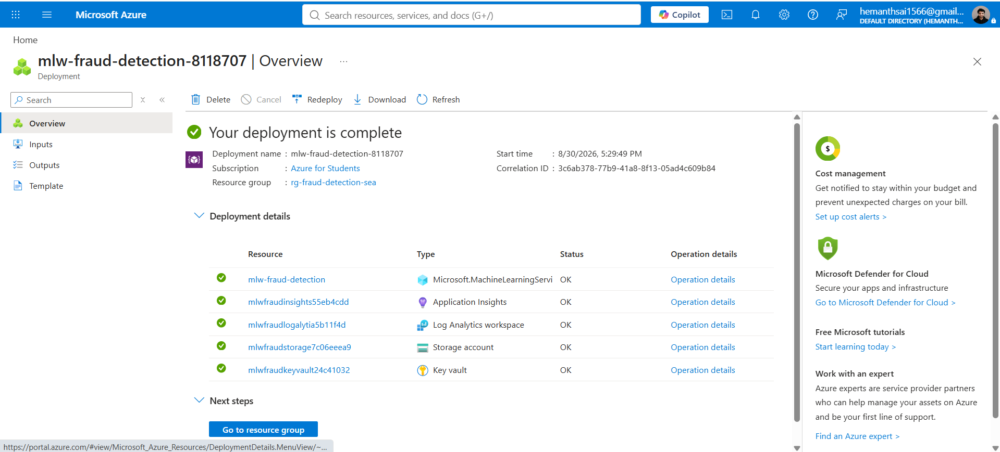
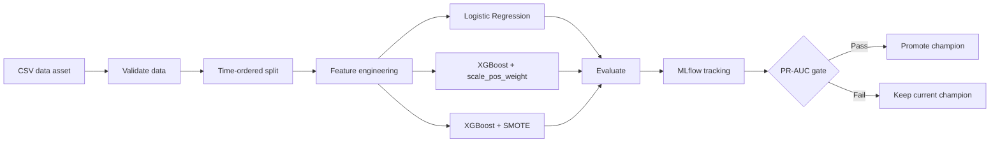
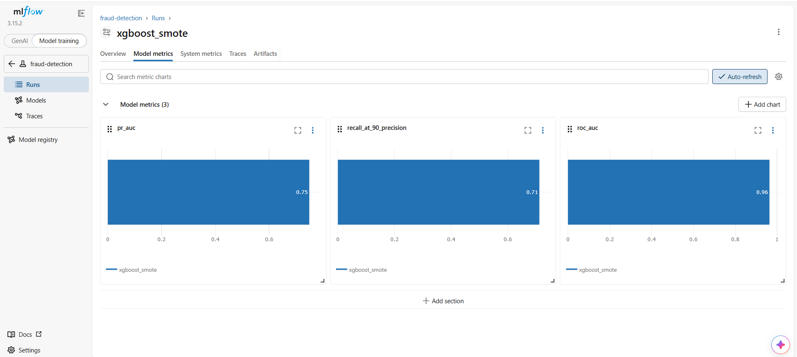
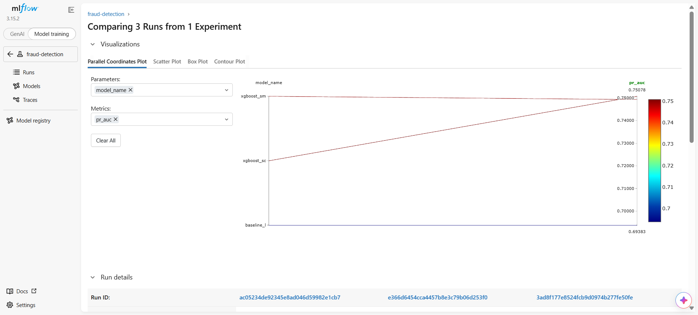
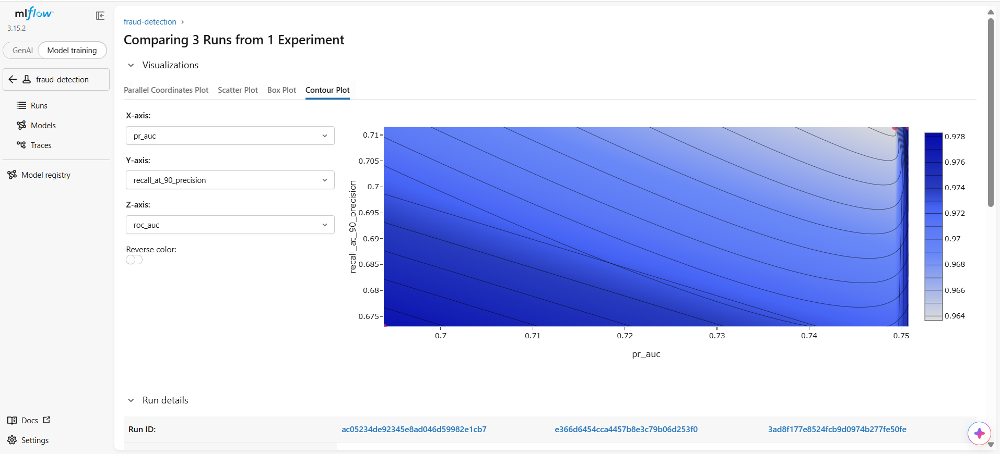
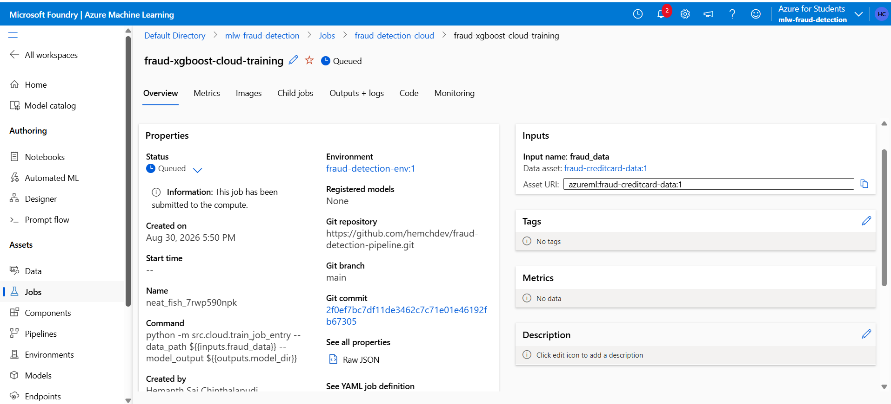
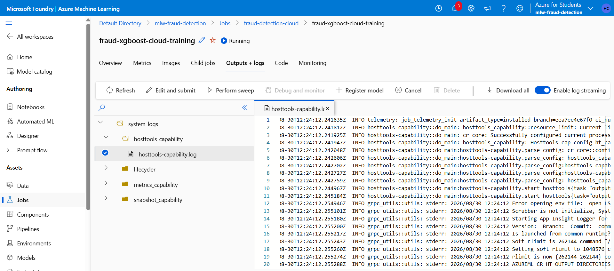
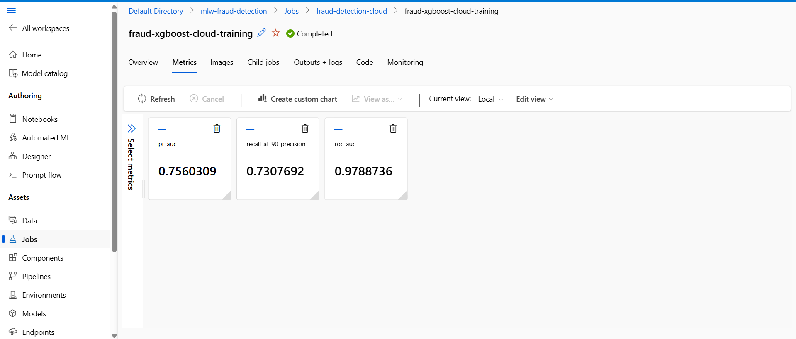
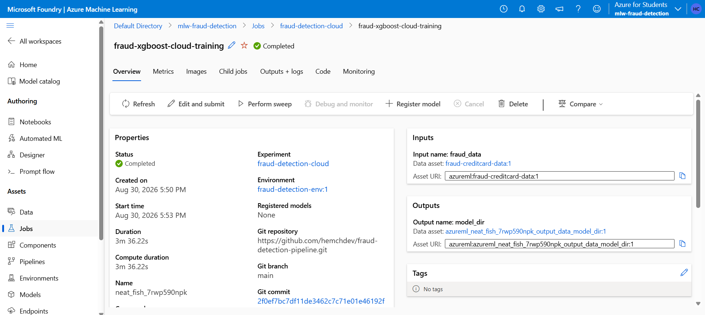

<div align="center">

# Fraud Detection Pipeline - Azure ML

An end-to-end machine learning pipeline for credit-card fraud detection, with reproducible local experiments, MLflow tracking, Azure Machine Learning training, and GitHub Actions automation.

<p>
  <a href="https://github.com/ihemanthc/fraud-detection-pipeline/actions/workflows/ci.yml"></a>
  <a href="https://github.com/ihemanthc/fraud-detection-pipeline/blob/main/LICENSE"></a>
  <a href="https://github.com/ihemanthc/fraud-detection-pipeline"></a>
</p>

<p>
  <a href="#quick-start"></a>
  <a href="#pipeline-architecture"></a>
  <a href="#azure-ml-workflow"></a>
  <a href="https://github.com/ihemanthc/fraud-detection-pipeline"></a>
</p>

<p><strong>Built with</strong></p>

<p>
  <a href="https://www.python.org/"></a>
  <a href="https://pandas.pydata.org/"></a>
  <a href="https://numpy.org/"></a>
  <a href="https://scikit-learn.org/"></a>
  <a href="https://xgboost.readthedocs.io/"></a>
  <a href="https://imbalanced-learn.org/"></a>
  <a href="https://mlflow.org/"></a>
  <a href="https://azure.microsoft.com/products/machine-learning"></a>
  <a href="https://github.com/features/actions"></a>
  <a href="https://www.docker.com/"></a>
</p>

<p align="center">
  
</p>

<p><em>Experiment overview: the baseline and XGBoost candidates tracked in MLflow.</em></p>

</div>

## Overview

Fraud detection is an imbalanced classification problem: legitimate transactions substantially outnumber fraudulent ones. This project demonstrates a production-oriented training workflow that validates data, engineers features, compares baseline and boosted models, evaluates with fraud-aware metrics, tracks experiments, and promotes a champion model only when it meets the quality gate.

The repository supports both:

- **Local development** for fast, reproducible experimentation.
- **Azure ML execution** for managed cloud training, versioned data assets, and captured job outputs.

> The included generator creates a synthetic dataset for development. It is useful for validating the pipeline, but its results must not be treated as production model performance.

## Capabilities

- Validates incoming data before training: schema, missing values, target labels, amounts, and fraud presence.
- Uses a time-ordered train/validation/test split to reduce temporal leakage.
- Adds `log_amount` and `hour_of_day` features while preserving the anonymized PCA features.
- Compares Logistic Regression with two XGBoost imbalance strategies: `scale_pos_weight` and SMOTE.
- Reports PR-AUC, ROC-AUC, Recall at 90% precision, and a confusion matrix.
- Logs parameters, metrics, and model artifacts to MLflow.
- Promotes a champion model using PR-AUC as the primary gate metric.
- Runs the same core training approach locally, in Docker, and as an Azure ML command job.
- Automates formatting, linting, tests, dependency auditing, container builds, and cloud retraining through GitHub Actions.

## Pipeline architecture



## Quick start

### Prerequisites

- Python 3.10 or newer
- Git
- Optional: Docker, Azure CLI, and an Azure ML workspace for cloud training

### 1. Clone and create an environment

```bash
git clone https://github.com/ihemanthc/fraud-detection-pipeline.git
cd fraud-detection-pipeline
python -m venv .venv
```

Activate the environment:

```powershell
# Windows PowerShell
.\.venv\Scripts\Activate.ps1
```

```bash
# macOS / Linux
source .venv/bin/activate
```

### 2. Install dependencies

```bash
python -m pip install --upgrade pip
pip install -r requirements.txt -r requirements-dev.txt
```

### 3. Generate development data

The generator writes a small, deterministic dataset to `data/raw/creditcard.csv`.

```bash
python -m src.data.make_sample_data
```

### 4. Run the complete local pipeline

```bash
python -m src.pipeline.train_pipeline
```

This validates the data, trains all available candidate models, evaluates them on the held-out test set, logs each run to MLflow, and updates the champion metadata when the best candidate passes the gate.

### 5. Inspect experiments in MLflow

```bash
mlflow ui --host 127.0.0.1 --port 5000
```

Open [http://127.0.0.1:5000](http://127.0.0.1:5000) and select the `fraud-detection` experiment.

### 6. Run quality checks

```bash
pytest -q
black --check src tests
flake8 src tests
```

## Common commands

| Purpose | Command |
| --- | --- |
| Validate the raw dataset | `python -m src.pipeline.validate_data` |
| Inspect the time-based split | `python -m src.data.load_data` |
| Train the Logistic Regression baseline | `python -m src.models.train_baseline` |
| Train both XGBoost variants | `python -m src.models.train_xgboost` |
| Compare saved models | `python -m src.models.compare_models` |
| Evaluate the baseline | `python -m src.models.evaluate` |
| Run the full local workflow | `python -m src.pipeline.train_pipeline` |
| Build the training container | `docker build -t fraud-detection:latest .` |

## Model evaluation

Accuracy is intentionally not the primary metric because a classifier can achieve high accuracy by predicting “legitimate” for nearly every transaction. The project uses:

| Metric | Why it matters |
| --- | --- |
| **PR-AUC** | Primary model-selection metric for rare positive classes and false-alarm control. |
| **ROC-AUC** | Secondary ranking metric for overall class separation. |
| **Recall @ 90% precision** | Measures how much fraud can be caught while keeping flagged transactions at least 90% precise. |
| **Confusion matrix** | Shows the underlying true-positive, false-positive, false-negative, and true-negative counts. |

One captured Azure ML run reported the following values. Results vary with the input dataset and should be regenerated for every model version:

| PR-AUC | ROC-AUC | Recall @ 90% precision |
| ---: | ---: | ---: |
| 0.7560 | 0.9789 | 0.7308 |

## Experiment tracking evidence

The screenshots below document the local MLflow workflow: per-run metrics and side-by-side model comparisons. The experiment overview is shown in the hero image above.

<p align="center">
  
</p>

<p align="center"><em>PR-AUC, Recall at 90% precision, and ROC-AUC for an XGBoost + SMOTE run.</em></p>

<p align="center">
  
</p>

<p align="center"><em>Parallel-coordinates comparison of model runs.</em></p>

<p align="center">
  
</p>

<p align="center"><em>Contour visualization across the tracked evaluation metrics.</em></p>

## Azure ML workflow

The Azure path uses the same feature engineering, validation, time-based split, and XGBoost training logic as the local workflow. Azure ML supplies the versioned data asset, compute target, environment, job tracking, and model output location.

### Provision Azure resources

Install and authenticate with the [Azure CLI](https://learn.microsoft.com/cli/azure/install-azure-cli):

```bash
az extension add --name ml
az login
```

Create or select a resource group and workspace. The defaults below match the repository configuration:

```bash
az group create --name rg-fraud-detection-sea --location southeastasia
az ml workspace create --name mlw-fraud-detection-sea --resource-group rg-fraud-detection-sea
az configure --defaults group=rg-fraud-detection-sea workspace=mlw-fraud-detection-sea
az ml compute create --name cpu-cluster --type AmlCompute --size Standard_DS2_v2 --min-instances 0 --max-instances 1
az ml environment create --file aml/aml-environment.yml
```

### Register the data asset

After placing either the generated dataset or the real `creditcard.csv` at `data/raw/creditcard.csv`, set the Azure identifiers and register the file:

```powershell
# Windows PowerShell
$env:AZURE_SUBSCRIPTION_ID = (az account show --query id -o tsv)
$env:AZURE_RESOURCE_GROUP = "rg-fraud-detection-sea"
$env:AZURE_ML_WORKSPACE = "mlw-fraud-detection-sea"
python -m src.cloud.register_data_asset
```

The job definition references the latest version of the `fraud-creditcard-data` asset.

### Submit and retrieve a cloud run

```bash
az ml job create --file aml/job.yml --web
az ml job download --name <job-name> --output-name model_dir --download-path ./outputs/from_azure
```

The cloud job writes `model.joblib` to the downloaded output directory and logs its evaluation metrics to Azure ML / MLflow.

### Azure ML run evidence

<p align="center">
  
</p>

<p align="center"><em>Azure resources provisioned for the machine learning workspace.</em></p>

<p align="center">
  
</p>

<p align="center"><em>Cloud training job submitted with the registered fraud data asset.</em></p>

<p align="center">
  
</p>

<p align="center"><em>Azure ML job logs while training is in progress.</em></p>

<p align="center">
  
</p>

<p align="center"><em>Tracked metrics from the completed cloud training run.</em></p>

<p align="center">
  
</p>

<p align="center"><em>Completed job with the versioned input data asset and model output.</em></p>

## CI/CD

### Continuous integration

`.github/workflows/ci.yml` runs on pushes and pull requests to `main` and performs:

1. Dependency installation
2. Black formatting validation
3. Flake8 linting
4. Pytest execution
5. Dependency vulnerability scanning with `pip-audit`
6. Docker image build validation

### Continuous delivery

`.github/workflows/cd.yml` runs on pushes to `main` or by manual dispatch. It authenticates to Azure with OIDC, submits the Azure ML job, parses the reported metrics, evaluates the candidate against `aml/champion_metrics.json`, and commits updated champion metrics only when the candidate is promoted.

Configure these GitHub repository secrets before enabling cloud retraining:

- `AZURE_CLIENT_ID`
- `AZURE_TENANT_ID`
- `AZURE_SUBSCRIPTION_ID`

The federated credential subject must match the actual GitHub repository and branch used by the workflow.

## Use the real dataset

For a meaningful evaluation, download the [Credit Card Fraud Detection dataset](https://www.kaggle.com/datasets/mlg-ulb/creditcardfraud) and place `creditcard.csv` at:

```text
data/raw/creditcard.csv
```

The repository ignores `data/raw/*.csv` so the dataset is not committed. Re-run the full pipeline after replacing the generated sample data.

## Repository layout

```text
fraud-detection-pipeline/
├── aml/                    Azure ML environment, job, and promotion gate
├── data/
│   ├── raw/                Local dataset location (ignored by Git)
│   └── processed/          Processed-data workspace
├── outputs/                Local and downloaded model artifacts
├── screens/                MLflow and Azure ML workflow screenshots
├── src/
│   ├── cloud/              Azure ML registration and job entrypoint
│   ├── data/               Dataset generation and time-based splitting
│   ├── features/           Feature engineering
│   ├── models/             Training, evaluation, and comparison
│   ├── pipeline/           Validation and end-to-end orchestration
│   └── utils/              Shared paths and configuration
├── tests/                  Automated tests
├── .github/workflows/      CI and CD workflows
├── Dockerfile              Training container definition
├── requirements.txt        Runtime dependencies
└── README.md               Project documentation
```

## Limitations and next steps

- The generated dataset is synthetic and intentionally easy to learn; it is not a substitute for real transaction data.
- The project currently focuses on offline training and evaluation. A real-time scoring API, endpoint deployment, monitoring, threshold management, and drift detection would be natural next additions.
- Cloud resources can incur charges while compute is running. Configure budgets and delete unused resources when experiments are complete.

## License

Distributed under the MIT License. See [LICENSE](LICENSE) for details.
